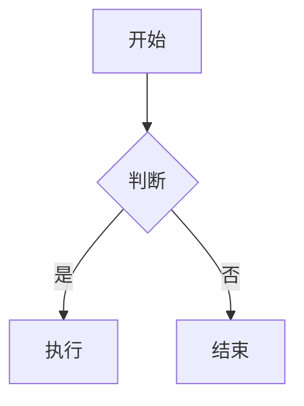

# Markdown 预览

**状态**: ✅ 已完成
**版本**: v0.5
**更新日期**: 2026-02-27

## 功能概述

Markdown 预览功能提供高质量的文档渲染，支持代码高亮、数学公式、图表和 YAML frontmatter 元数据。

## 核心功能

### Markdown 渲染

- 标准 Markdown 语法
- GFM (GitHub Flavored Markdown) 扩展

### YAML Frontmatter 支持

- 自动解析文档顶部的 YAML frontmatter
- 结构化显示常见元数据字段
- 支持的字段：title, date, author, tags, description
- 其他字段自动降级显示
- frontmatter 内容参与全文搜索

### 代码高亮

- 多语言语法高亮
- 行号显示
- 复制代码按钮

### 数学公式

- LaTeX 公式渲染
- 行内公式 `$...$`
- 块级公式 `$$...$$`

### 图表支持

- Mermaid 流程图
- Mermaid 时序图
- Mermaid 甘特图

## 实现细节

### 组件

```vue
<!-- components/MarkdownViewer.vue -->
<template>
  <XMarkdown
    :content="content"
    :enable-latex="true"
    :enable-mermaid="true"
    :enable-highlight="true"
  />
</template>
```

### 依赖

使用 Element-Plus-X 的 XMarkdown 组件：

- 基于 Shiki 的代码高亮
- 基于 KaTeX 的数学公式
- 基于 Mermaid 的图表

### Store 集成

```javascript
// stores/document.js
export const useDocumentStore = defineStore('document', () => {
  const currentFile = ref(null)
  const content = ref('')
  const isLoading = ref(false)
  const error = ref(null)

  async function loadFile(filePath) {
    isLoading.value = true
    error.value = null
    try {
      content.value = await window.electronAPI.readFile(filePath)
      currentFile.value = filePath
    } catch (e) {
      error.value = e.message
    } finally {
      isLoading.value = false
    }
  }

  return { currentFile, content, isLoading, error, loadFile }
})
```

## 支持的语法

### 标准 Markdown

- 标题 `#`
- 段落和换行
- 强调 `**粗体**` `*斜体*`
- 列表（有序、无序）
- 链接和图片
- 引用块 `>`
- 代码块 ``` ` ```
- 分割线 `---`

### GFM 扩展

- 表格
- 任务列表
- 删除线
- 自动链接

### LaTeX 公式

```latex
行内公式: $E = mc^2$

块级公式:
$$
\int_{-\infty}^{\infty} e^{-x^2} dx = \sqrt{\pi}
$$
```

### Mermaid 图表



## 错误处理

| 场景 | 处理 |
|------|------|
| 文件读取失败 | 显示错误消息 |
| Markdown 解析失败 | 显示原始文本 |
| 公式渲染失败 | 显示 LaTeX 源码 |
| 图表渲染失败 | 显示 Mermaid 源码 |

## YAML Frontmatter 使用

### 示例

```markdown
---
title: 我的文档标题
date: 2026-02-27
author: 作者姓名
tags: [vue, electron, 笔记]
description: 这是文档的描述信息
category: 技术
---

# 正文开始

这里是正文内容...
```

### 支持的字段

| 字段 | 类型 | 说明 |
|------|------|------|
| `title` | string | 文档标题（大标题显示） |
| `date` | string/Date | 发布日期 |
| `author` | string | 作者名称 |
| `tags` | string[] | 标签数组 |
| `description` | string | 文档描述 |
| 其他字段 | any | 自动降级显示为键值对 |

## 性能优化

- 大文件分块渲染（计划 v0.3）
- 图片懒加载（计划 v0.3）
- 渲染结果缓存（计划 v0.3）
